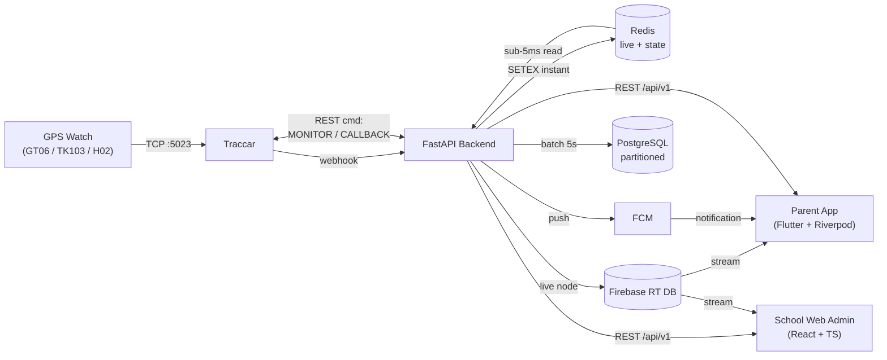

# IzySafe — System Architecture

> Living architecture document. Updated at the end of each sprint to reflect what is
> actually built. For locked conventions and AI coding rules, see [`CLAUDE.md`](./CLAUDE.md).
> For the full product specs, see [`../docs/`](../docs/).

**Status:** Sprint 4 — SOS (Flow C) + Alerts Inbox ✅ COMPLETE
**Next:** Sprint 5 — (next in the Sprint Plan: Sound Around / Two-way Call via Traccar SIM commands, or School web admin)
**Last updated:** End of Sprint 4

---

## 1. High-Level Overview

IzySafe is a GPS child-safety platform (India + UAE). A child's GPS watch reports position
to **Traccar**, which webhooks the **FastAPI** backend. The backend fans each update out to
three stores chosen for their job:

- **Redis** — instant live reads (sub-5ms), geofence state, rate limits, online status.
- **Firebase Realtime DB** — pushes live updates to the parent **Flutter** app (live map).
- **PostgreSQL** — durable, monthly-partitioned location history + all relational data.

Push alerts go out via **FCM**. A **React** web admin (school tier) reuses the same backend.



> Note the bidirectional API ↔ Traccar link: besides receiving position/alarm webhooks,
> the backend issues **Traccar SIM commands** for Sound Around (`MONITOR`) and Two-way
> Call (`CALLBACK`) — no media server (locked decision, see CLAUDE.md §3.12).

---

## 2. Components

| Component | Tech | Role | First built |
|---|---|---|---|
| GPS middleware | Traccar (PostgreSQL backend) | Decode GT06/TK103/H02, position + alarm webhooks, SIM commands | Sprint 0 |
| Backend API | FastAPI + SQLAlchemy async | Business logic, REST, webhooks, background tasks | Sprint 1 |
| Relational DB | PostgreSQL 16 | Source of truth; `locations` partitioned monthly | Sprint 0 |
| Cache | Redis 7 | Live location, geofence state, rate limits, online TTL | Sprint 0 |
| Real-time | Firebase RT DB (Blaze) | Live map streaming to apps | Sprint 2 |
| Push | FCM | Alerts; high-priority SOS bypasses DND | Sprint 2 |
| Mobile app | Flutter 3 + Riverpod | Parent/guardian app | Sprint 3 |
| Web admin | React 18 + TS + Vite | School dashboard, attendance, buses | Sprint 9 |
| Async jobs | Celery + Redis broker | Weekly PDF, expiry sweep, partition roll, ML | Sprint 6 |

---

## 3. Key Data Flows

(Reproduced from `CLAUDE.md` §5 — the authoritative copy lives there.)

### Flow A — Live location (target < 1 second)
```
Watch → GT06 packet → Traccar (:5023)
  → POST /api/v1/webhook/traccar  (static X-Traccar-Secret header, constant-time compare)
    → location_service.process_update():   [HOT PATH — Redis only]
        validate (lat/lng bounds, valid flag, null-island); stale (>5min) → alerts suppressed
        Redis SETEX  location:child:{id}:latest      TTL 24h   (instant)
        Redis SETEX  location:device:{id}:latest     TTL 24h
        Redis SETEX  device:{id}:online = 1          TTL 300s  (sliding)
        Redis SET    device:{id}:lastseen            (offline detection)
        Redis LPUSH  batch:locations                  (flushed every 5s → PostgreSQL)
    → BackgroundTasks [off hot path]:
        Firebase RT DB  live_locations/{child_id}/latest        (parent streams this)
        device online-transition reconcile · battery check · speed check
        geofence_service.check_all_fences(child_id, lat, lng)   (Sprint 3)
  → Parent Flutter Firebase listener → Google Maps marker animates
```

### Flow B — Geofence breach → FCM
```
check_all_fences():
  circle: haversine(); polygon: ray-casting point-in-polygon
  honor schedule (active_days / active_from / active_to) — suppress FCM outside window
  prev state ← Redis geofence:{child}:{fence}:inside
  on transition (enter/exit):
     INSERT geofence_events + INSERT alerts (one per family member)
     fcm_service.send_to_family(child_id, title, body)
     SETEX geofence:{child}:{fence}:inside = new_state  TTL 72h
  5-minute debounce (geofence_debounce:{child}:{fence}) prevents jitter spam
```

### Flow C — SOS (highest priority, always overrides School Mode)
```
Watch SOS button held 3s → GT06 alarm → Traccar
  → POST /api/v1/webhook/traccar/alarm  (secret key)
    → dedup (ignore if active SOS for child within 30s)
      INSERT sos_events (one-active-per-child via partial unique index)
      Firebase RT DB  sos/{child_id} = {active:true, lat, lng, triggered_at}
      fcm_service.send_urgent() to ALL family + emergency_contacts (priority MAX, bypass DND)
  → Parent app: FULL-SCREEN modal (not swipe-dismissible) until someone taps Resolve
  → Resolve clears sos/{child_id}.active for everyone simultaneously
```

---

## 4. Data Model

- **Canonical schema:** [`backend/db/schema.sql`](./backend/db/schema.sql) — **33 tables**, fully commented with design decisions.
- **Source of truth executed against the DB:** Alembic migrations in `backend/alembic/versions/` (kept in sync with `schema.sql`).
- **Highlights:**
  - `locations` is `PARTITION BY RANGE (timestamp)`, one partition per month, with a `DEFAULT` catch-all and a `create_locations_partition(year, month)` function (rolled forward monthly by a Celery-beat cron). `child_id` is denormalized into `locations` for fast per-child history.
  - UUID PKs everywhere except high-volume append tables (`locations`, `*_events` → BIGSERIAL).
  - Soft deletes on `users`, `children`, `devices`.
  - One active SOS per child enforced by a partial unique index.
  - Ownership/authorization expressed entirely through `family_members` (no owner FK on `children`).

**Table groups:** Auth & billing (`users`, `otp_sessions`, `subscriptions`) · Children & family (`children`, `family_members`, `invites`) · Devices (`devices`, `pairing_codes`) · Location (`locations`, `geofences`, `geofence_events`, `pickup_events`) · Routes & sharing (`safe_routes`, `share_links`) · Emergency (`sos_events`, `emergency_contacts`) · Notifications (`alerts`) · Comms (`audio_sessions`, `call_records`, `chat_messages`) · Teen (`trips`, `crash_events`) · Integrations (`izylrn_links`, `wearable_integrations`) · i18n (`translations`) · School (`schools`, `school_admins`, `student_enrollments`, `attendance_records`, `drivers`, `bus_routes`, `bus_route_stops`, `bus_assignments`).

---

## 5. Environments

| | Dev | Prod |
|---|---|---|
| Orchestration | Docker Compose (`docker-compose.yml`) | Docker Compose on Hostinger VPS |
| Postgres | container, shared by app + Traccar (separate DBs) | managed/self-hosted, partitioned |
| Redis | container, persistence off | container, persistence off |
| Traccar | container, **PostgreSQL backend** (never H2) | dedicated host at 10K scale |
| Firebase | real **dev** project (Blaze) | prod project (Blaze) |
| Scale note | single host | at 10K students: split FastAPI / PostgreSQL / Traccar / Redis onto separate servers |

---

## 6. Sprint 0 Status — ✅ COMPLETE

| Step | Item | Status |
|---|---|---|
| 1 | Monorepo folder structure | ✅ Done |
| 2 | `CLAUDE.md` (conventions + locked decisions) | ✅ Done |
| 3 | `ARCHITECTURE.md` (this file) | ✅ Done |
| 4 | `docker-compose.yml`, `.env.example`, `traccar/traccar.xml`, Postgres init script | ✅ Done |
| 5 | SQLAlchemy async models + first Alembic migration | ✅ Done |
| 6 | Bring up stack + run migration | ✅ Done |
| 7 | Health check: services, DBs, 33 tables, partitions | ✅ Done |
| — | Hardware spike: GT06 packet → Traccar; probe MONITOR/CALLBACK | 📋 Runbook ready ([`docs/HARDWARE_SPIKE.md`](./docs/HARDWARE_SPIKE.md)); awaits physical watch |

**Verified outcome (real run):**
- All 4 services healthy: `backend` (:8000), `postgres` (:5432), `redis` (:6380→6379), `traccar` (:8082/:5023/:5002/:5013).
- Both databases exist (`izysafe` + `traccar`); **Traccar runs Liquibase on PostgreSQL** (not H2).
- Migration `0001_initial_schema` applied → **33 application tables**, **20 `locations` partitions** (default + 19 monthly, 2026-06 → 2027-12).
- Partition routing proven live; `create_locations_partition` + `set_updated_at` functions present; `/health` → `{"status":"ok"}`.

**Issues encountered & fixed during bring-up:**
- Traccar `SAXParseException` — `--` inside XML comments in `traccar.xml` (illegal); comments rewritten.
- Redis host-port `6379` clash with another local stack — remapped host port to `6380` (in-cluster stays `redis:6379`).
- Corrected a documentation miscount: schema is **33 tables**, not 35 (ORM metadata and live DB agree exactly).

---

## 7. Sprint 1 Status — ✅ COMPLETE (merged to `main`, PR #1)

Authentication, User, Children, and Family management — **29 endpoints, 88 tests**.

- **Auth/OTP:** JWT HS256 (access 24h / refresh 30d) + Redis denylist (`denylist:{access,refresh}:{jti}`) with refresh rotation; OTP 6-digit bcrypt, WhatsApp→SMS fallback, Redis rate limits. `get_current_user` fail-open on Redis down; refresh/logout fail-closed.
- **Children & Family:** ownership/authorization entirely through `family_members` (no owner FK); non-members get 404; primary parent protected; tier limits counted over the primary parent (incl. pending invites). Guardian invite + accept (strict phone match).

---

## 8. Sprint 2 Status — ✅ COMPLETE (real-time location pipeline)

The full Flow A pipeline (Traccar → Redis → batch → Firebase → status/battery/speed alerts), built slice-by-slice with tests + live verification. **+56 tests (144 total).**

| Slice | Delivered | Notes |
|---|---|---|
| 1 | `POST /webhook/traccar` hot path | secret-header auth, device-resolve (Redis cache), validation, always-ack 200; Redis-only writes |
| 2 | 5s batch writer (lifespan loop) | FIFO drain ≤1000, bulk insert → `locations`, transient-fail requeue, poison-drop, shutdown flush |
| 3 | Firebase RT DB live location | `RealtimeGateway`, sync SDK in `asyncio.to_thread`, off hot path, graceful when Firebase down |
| 4 | Device online/offline | online-transition reconcile (BackgroundTask) + 60s offline sweep (15min) → `device_offline`; shared `FcmGateway` + `AlertService` |
| 5 | Battery alerts | `low_battery`/`critical_battery`, per-level 4h debounce, escalation, recharge reset; guardian-accepted FCM (`family_join`) cleared |
| 6 | Speed alerts | 3 sustained samples in 90s window, slowdown reset, 10min debounce, Basic+ tier-gated |

**Architecture invariants held:** the webhook hot path is **Redis-only**; every check (battery/speed/online/geofence) runs in a `BackgroundTask` or lifespan loop (CLAUDE.md §4); all external gateways (Firebase RTDB, FCM) are faked in tests and degrade gracefully in production. Alert fan-out is uniform via `AlertService` (one `alerts` inbox row per family member + multicast FCM).

**New runtime components:** `BatchWriter` + `DeviceStatusMonitor` (lifespan tasks); `RealtimeGateway`, `FcmGateway`, `AlertService`, `BatteryService`, `SpeedService`, `DeviceStatusService`. `firebase-admin` added (live-verified against the real `izysafe-dev` Realtime Database).

**Not built (by design):** `GET /children/{id}/location/latest` read endpoint (the app streams live location from Firebase); geofence breach detection (Flow B) is Sprint 3 — the BackgroundTask call site is reserved but unwired.

---

## 9. Sprint 3 Status — ✅ COMPLETE (geofences, Flow B)

The full Flow B pipeline — zone CRUD → geometry → breach state machine → School
Mode — built slice-by-slice with tests + live verification. **+70 tests (214 total).**

| Slice | Delivered | Notes |
|---|---|---|
| 1 | Geofence CRUD + validation + tier gating | `POST/GET /children/{id}/geofences`, `GET/PUT/DELETE /geofences/{id}`; circle/polygon shape validation; per-child zone limit (Free 1 / Basic 5 / Premium·School ∞) + polygon=Premium+ (both 402); authz via `family_members` (404 for non-members); hard delete |
| 2 | Pure-Python geometry engine | `haversine_m`, `is_inside_circle`, `is_inside_polygon` (ray-casting/PNPOLY); ORM-free, side-effect-free; `GeofenceService.is_point_inside` dispatch |
| 3 | Breach detection engine | `GeofenceBreachService` (webhook BackgroundTask): enter/exit state machine (Redis `geofence:{child}:{fence}:inside`, 72h), baseline-first, notify flags, fence schedule (parent tz — Decision C), 5-min debounce, `geofence_events` + `AlertService` fan-out; **active-fence bundle cached** per child (Decision E), CRUD-invalidated; wired into `/webhook/traccar`, skipped on stale fixes |
| 4 | School Mode + events history | school-zone enter → `school_arrival`, non-school alerts suppressed during school hours (Basic+; Decision G); `GET /geofences/{id}/events`. `school_absent` deferred to Sprint 6 |

**Architecture invariants held:** breach checks run **only** in the webhook
`BackgroundTask` (never the hot path); the common no-transition ping touches
**Redis only** (cached fence bundle); alerts fan out uniformly via `AlertService`;
the breach service uses a **session_factory** (own session). Geometry is pure
Python (Decision A) — no PostGIS/NumPy.

**Schema change:** migration `0002_geofence_active_days` widens the
`geofences.active_days` DEFAULT from Mon–Fri to **all 7 days** (a zone with no
explicit schedule now alerts 24/7). The child's `school_active_days` stays Mon–Fri.

**New runtime components:** `GeofenceBreachService` (breach engine);
`GeofenceService` gained Redis for cache invalidation; `geometry.py` core helpers.

---

## 10. Sprint 4 Status — ✅ COMPLETE (SOS Flow C + Alerts inbox)

The full Flow C emergency pipeline (alarm → dedup → fan-out → resolve) plus the
per-user notification inbox, built slice-by-slice with tests + live verification.
**+47 tests (259 total).**

| Slice | Delivered | Notes |
|---|---|---|
| 1 | `POST /webhook/traccar/alarm` (SOS trigger) | secret-header auth; resolve inline, fan-out in a BackgroundTask via `SosAlarmService`; dedup (Redis `sos:{child}:active` + DB pre-check + one-active partial unique index); last-known-location fallback → `approximate`; urgent FCM (Decision C) + Firebase `sos/{child}` node |
| 2 | SOS read/resolve API | `GET /sos/active` (family-scoped), `PUT /sos/{id}/resolve` (any member — Decision F); clears the Redis marker + flips Firebase `sos/{child}/active` to false; idempotent |
| 3 | Emergency Contacts + SOS fan-out | CRUD `POST/GET /children/{id}/emergency-contacts`, `PUT/DELETE /emergency-contacts/{id}` (Premium, Decision D); `is_app_user` derived by phone; urgent FCM also goes to app-user contacts, excluding family (no double-push) |
| 4 | Alerts inbox API | `GET /alerts` (paginate + `?unread=`/`?child_id=`, `meta.unread_count`), `PUT /alerts/{id}/read`, `PUT /alerts/read-all`; per-user scoped (`AlertInboxService`) |

**Architecture invariants held:** the SOS trigger is the **secret-authed alarm
webhook** (never JWT); the heavy work runs in a webhook `BackgroundTask`
(`SosAlarmService`, own `session_factory`); **one active SOS per child** is enforced
by the partial unique index; SOS sends MAX-priority FCM that **bypasses DND/School
Mode**; resolve clears state for everyone simultaneously (Firebase + Redis). All
gateways are faked in tests and degrade gracefully. Request-path read/CRUD services
(`SosService`, `EmergencyContactService`, `AlertInboxService`) mirror the geofence
request-vs-engine split.

**New runtime components:** `SosAlarmService` (alarm BackgroundTask) + `SosService`
(read/resolve), `EmergencyContactService`, `AlertInboxService`; `RealtimeGateway`
gained `set_sos`/`clear_sos`; `FcmGateway.send` gained an `urgent` (MAX-priority) path.

---

## 10a. Sprint 5 Status — ✅ COMPLETE (Audio: Sound Around F11 + Two-way Call F12)

Remote audio via **Traccar SIM commands — no media server** (locked §3.12): the backend
only **gates, issues the command, and logs**; the watch dials the requesting parent over
its own SIM, so the audio never touches our servers. **+27 tests (286 total).**

| Slice | Delivered | Notes |
|---|---|---|
| 1 | `TraccarGateway` + Sound Around | `POST /children/{id}/sound-around` → `MONITOR,<phone>#`; gates can_call → Basic+ (over primary parent) → watch online (Redis) → **3/child/day** (`sound_sessions:{child}`, midnight TTL in the primary parent's tz); logs `audio_sessions` |
| 2 | Two-way Call | `POST /children/{id}/two-way-call` → `CALLBACK,<phone>#`; same gate stack + a **no-active-call** guard (Redis `call:{child}:active`, 5-min self-expiring); logs `call_records` (`status='initiated'`) |

**Design realities under no-media-server:** the watch dials the **requesting user's**
phone (the listener = `audio_sessions.user_id` / `call_records.initiated_by`). Command
outcome (answer / duration / miss) is **not observable** backend-side, so `duration_*`
stays NULL, `call_records.status` stays `'initiated'`, and the call's "in progress" state
is a **time-bounded Redis marker** rather than a cleared-on-hang-up flag (no end signal
exists). Quota / marker / audit row advance **only on a successful dispatch** (a Traccar
502 leaves them untouched). Command strings are GT06-**model-specific** and live in config
(`traccar_monitor_template`/`traccar_callback_template`) — true end-to-end delivery is
validated by the physical-watch spike (`docs/HARDWARE_SPIKE.md` §4), still pending.

**Live-verified vs Traccar:** both `MONITOR` and `CALLBACK` reached Traccar's command API
(HTTP 200) and persisted to `tc_commands`. **Finding:** `POST /api/commands` requires a
non-null `description` — for an offline device Traccar queues the command into
`tc_commands.description` (NOT NULL) and 400s without it; the gateway always sends one.

**New runtime components:** `TraccarGateway` (outbound commands, faked in tests);
`_AudioFeatureService` shared gate base → `SoundAroundService` + `TwoWayCallService`.
No schema/migration change — `audio_sessions` + `call_records` already existed (Sprint 0).

---

## 10b. Sprint 6 Status — ✅ COMPLETE (Payments & Subscriptions + Celery)

Makes the tier system **purchasable + revenue-ready**: dual payment gateways routed by
country, webhook-driven activation, and the Celery scheduled-job mechanism (CLAUDE.md §4).
**+58 tests (325 total).**

| Slice | Delivered | Notes |
|---|---|---|
| 1 | Subscription core | plan catalog (`app/core/plans.py`, INR/AED by country, features + limits); `GET /subscriptions/plans` (meta.currency), `GET /subscriptions/me` (effective, expiry-aware tier + status). Drift-guard test vs enforcement limits |
| 2 | Razorpay (India) | `POST /subscriptions/checkout` → recurring subscription (`notes` carry {user_id, tier}); `POST /webhook/razorpay` HMAC-SHA256 verified → activate/renew/cancel |
| 3 | Stripe (UAE) | subscription-mode Checkout Session (`subscription_data.metadata`); `POST /webhook/stripe` (`Stripe-Signature` HMAC). **Unified checkout shape** across gateways; `PaymentService` routes by `country_code` |
| 4 | Celery + jobs | worker + beat services; expiry sweep (daily, durable downgrade), partition roll-forward (monthly, idempotent), 30-day soft-delete purge (daily) |

**Payment invariants:** activation is **webhook-driven only** (Decision D) — checkout never
grants a tier; the signature-verified webhook is the **single writer** of subscription state
(`SubscriptionWebhookService`, one `apply_*` per gateway sharing a gateway-parametrized
`_activate`). Both gateways carry `{user_id, tier}` in gateway metadata so the payer resolves
statelessly (no local pending row). Webhooks are **HMAC-signed** (stronger than Traccar's
fixed-secret header); **idempotent** per gateway event id (Redis `payevt:{gw}:{id}`); a bad
signature → 401, a genuine DB error propagates (5xx) so the gateway retries. Downgrade is
**non-destructive** (Decision E): `effective_tier` treats a lapsed tier as free on read, and
the daily expiry sweep makes it durable + notifies — existing resources are kept, only new
over-limit creation is blocked.

**Celery strategy (§4):** in-request checks stay on FastAPI BackgroundTasks and the batch
writer stays a lifespan loop; only scheduled/heavy jobs run on Celery. Sync task wrappers run
their async service via `asyncio.run` on a **fresh NullPool engine** (never bind the app
engine to a throwaway loop). Job logic lives in services (`SubscriptionExpiryService`,
`PartitionService`, `PurgeService`), unit-tested directly like the other session_factory jobs.

**Live-verified vs running infra:** both webhooks (bad-sig 401 → signed activation flips the
user tier + writes the row + alert → retry deduped) on real uvicorn/Postgres/Redis; all three
Celery jobs through the real broker → worker → Postgres. (Outbound *checkout* calls to
Razorpay/Stripe await real test API keys — the substantive webhook + job surfaces are proven.)

**New runtime components:** `RazorpayGateway`, `StripeGateway`, `PaymentService`,
`SubscriptionService`, `SubscriptionWebhookService`; `app/worker/` (Celery app + tasks) +
`celery-worker`/`celery-beat` compose services. No schema/migration change — `subscriptions`
existed since Sprint 0.

---

## 11. Maintenance

This file is updated at the **end of every sprint**: flip the status table, add any new
components/flows introduced, and note schema changes (with the migration that made them).
Keep architectural decisions in `CLAUDE.md` §3; keep *current state* here.

---

*IzySafe v1.0 — system architecture. See [`CLAUDE.md`](./CLAUDE.md) for conventions, [`../docs/`](../docs/) for full specs.*
