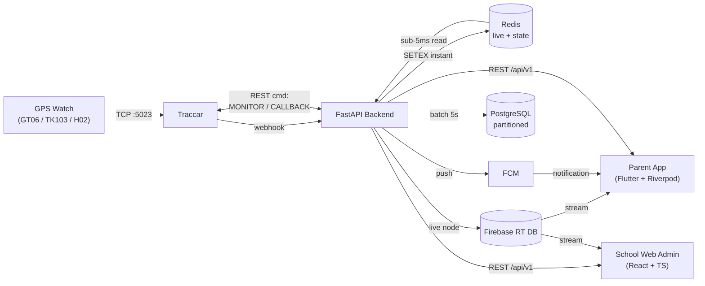

# IzySafe — System Architecture

> Living architecture document. Updated at the end of each sprint to reflect what is
> actually built. For locked conventions and AI coding rules, see [`CLAUDE.md`](./CLAUDE.md).
> For the full product specs, see [`../docs/`](../docs/).

**Status:** Sprint 0 — Infrastructure & Canonical Schema ✅ COMPLETE
**Next:** Sprint 1 — Authentication, OTP, User registration, Family management (backend-first)
**Last updated:** End of Sprint 0

---

## 1. High-Level Overview

IzySafe is a GPS child-safety platform (India + UAE). A child's GPS watch reports position
to **Traccar**, which webhooks the **FastAPI** backend. The backend fans each update out to
three stores chosen for their job:

- **Redis** — instant live reads (sub-5ms), geofence state, rate limits, online status.
- **Firebase Realtime DB** — pushes live updates to the parent **Flutter** app (live map).
- **PostgreSQL** — durable, monthly-partitioned location history + all relational data.

Push alerts go out via **FCM**. A **React** web admin (school tier) reuses the same backend.



> Note the bidirectional API ↔ Traccar link: besides receiving position/alarm webhooks,
> the backend issues **Traccar SIM commands** for Sound Around (`MONITOR`) and Two-way
> Call (`CALLBACK`) — no media server (locked decision, see CLAUDE.md §3.12).

---

## 2. Components

| Component | Tech | Role | First built |
|---|---|---|---|
| GPS middleware | Traccar (PostgreSQL backend) | Decode GT06/TK103/H02, position + alarm webhooks, SIM commands | Sprint 0 |
| Backend API | FastAPI + SQLAlchemy async | Business logic, REST, webhooks, background tasks | Sprint 1 |
| Relational DB | PostgreSQL 16 | Source of truth; `locations` partitioned monthly | Sprint 0 |
| Cache | Redis 7 | Live location, geofence state, rate limits, online TTL | Sprint 0 |
| Real-time | Firebase RT DB (Blaze) | Live map streaming to apps | Sprint 2 |
| Push | FCM | Alerts; high-priority SOS bypasses DND | Sprint 2 |
| Mobile app | Flutter 3 + Riverpod | Parent/guardian app | Sprint 3 |
| Web admin | React 18 + TS + Vite | School dashboard, attendance, buses | Sprint 9 |
| Async jobs | Celery + Redis broker | Weekly PDF, expiry sweep, partition roll, ML | Sprint 6 |

---

## 3. Key Data Flows

(Reproduced from `CLAUDE.md` §5 — the authoritative copy lives there.)

### Flow A — Live location (target < 1 second)
```
Watch → GT06 packet → Traccar (:5023)
  → POST /api/v1/webhook/traccar  (HMAC-validated)
    → location_service.process_update():
        validate (lat/lng bounds, ts fresh ≤5min, accuracy)
        Redis SETEX  location:child:{id}:latest      TTL 24h   (instant)
        Redis SETEX  location:device:{id}:latest     TTL 24h
        Redis SETEX  device:{id}:online = 1          TTL 300s  (sliding)
        Firebase RT DB  live_locations/{child_id}/latest        (parent streams this)
        Redis LPUSH  batch:locations                  (flushed every 5s → PostgreSQL)
        BackgroundTask: geofence_service.check_all_fences(child_id, lat, lng)
  → Parent Flutter Firebase listener → Google Maps marker animates
```

### Flow B — Geofence breach → FCM
```
check_all_fences():
  circle: haversine(); polygon: ray-casting point-in-polygon
  honor schedule (active_days / active_from / active_to) — suppress FCM outside window
  prev state ← Redis geofence:{child}:{fence}:inside
  on transition (enter/exit):
     INSERT geofence_events + INSERT alerts (one per family member)
     fcm_service.send_to_family(child_id, title, body)
     SETEX geofence:{child}:{fence}:inside = new_state  TTL 72h
  5-minute debounce (geofence_debounce:{child}:{fence}) prevents jitter spam
```

### Flow C — SOS (highest priority, always overrides School Mode)
```
Watch SOS button held 3s → GT06 alarm → Traccar
  → POST /api/v1/webhook/traccar/alarm  (secret key)
    → dedup (ignore if active SOS for child within 30s)
      INSERT sos_events (one-active-per-child via partial unique index)
      Firebase RT DB  sos/{child_id} = {active:true, lat, lng, triggered_at}
      fcm_service.send_urgent() to ALL family + emergency_contacts (priority MAX, bypass DND)
  → Parent app: FULL-SCREEN modal (not swipe-dismissible) until someone taps Resolve
  → Resolve clears sos/{child_id}.active for everyone simultaneously
```

---

## 4. Data Model

- **Canonical schema:** [`backend/db/schema.sql`](./backend/db/schema.sql) — **33 tables**, fully commented with design decisions.
- **Source of truth executed against the DB:** Alembic migrations in `backend/alembic/versions/` (kept in sync with `schema.sql`).
- **Highlights:**
  - `locations` is `PARTITION BY RANGE (timestamp)`, one partition per month, with a `DEFAULT` catch-all and a `create_locations_partition(year, month)` function (rolled forward monthly by a Celery-beat cron). `child_id` is denormalized into `locations` for fast per-child history.
  - UUID PKs everywhere except high-volume append tables (`locations`, `*_events` → BIGSERIAL).
  - Soft deletes on `users`, `children`, `devices`.
  - One active SOS per child enforced by a partial unique index.
  - Ownership/authorization expressed entirely through `family_members` (no owner FK on `children`).

**Table groups:** Auth & billing (`users`, `otp_sessions`, `subscriptions`) · Children & family (`children`, `family_members`, `invites`) · Devices (`devices`, `pairing_codes`) · Location (`locations`, `geofences`, `geofence_events`, `pickup_events`) · Routes & sharing (`safe_routes`, `share_links`) · Emergency (`sos_events`, `emergency_contacts`) · Notifications (`alerts`) · Comms (`audio_sessions`, `call_records`, `chat_messages`) · Teen (`trips`, `crash_events`) · Integrations (`izylrn_links`, `wearable_integrations`) · i18n (`translations`) · School (`schools`, `school_admins`, `student_enrollments`, `attendance_records`, `drivers`, `bus_routes`, `bus_route_stops`, `bus_assignments`).

---

## 5. Environments

| | Dev | Prod |
|---|---|---|
| Orchestration | Docker Compose (`docker-compose.yml`) | Docker Compose on Hostinger VPS |
| Postgres | container, shared by app + Traccar (separate DBs) | managed/self-hosted, partitioned |
| Redis | container, persistence off | container, persistence off |
| Traccar | container, **PostgreSQL backend** (never H2) | dedicated host at 10K scale |
| Firebase | real **dev** project (Blaze) | prod project (Blaze) |
| Scale note | single host | at 10K students: split FastAPI / PostgreSQL / Traccar / Redis onto separate servers |

---

## 6. Sprint 0 Status — ✅ COMPLETE

| Step | Item | Status |
|---|---|---|
| 1 | Monorepo folder structure | ✅ Done |
| 2 | `CLAUDE.md` (conventions + locked decisions) | ✅ Done |
| 3 | `ARCHITECTURE.md` (this file) | ✅ Done |
| 4 | `docker-compose.yml`, `.env.example`, `traccar/traccar.xml`, Postgres init script | ✅ Done |
| 5 | SQLAlchemy async models + first Alembic migration | ✅ Done |
| 6 | Bring up stack + run migration | ✅ Done |
| 7 | Health check: services, DBs, 33 tables, partitions | ✅ Done |
| — | Hardware spike: GT06 packet → Traccar; probe MONITOR/CALLBACK | 📋 Runbook ready ([`docs/HARDWARE_SPIKE.md`](./docs/HARDWARE_SPIKE.md)); awaits physical watch |

**Verified outcome (real run):**
- All 4 services healthy: `backend` (:8000), `postgres` (:5432), `redis` (:6380→6379), `traccar` (:8082/:5023/:5002/:5013).
- Both databases exist (`izysafe` + `traccar`); **Traccar runs Liquibase on PostgreSQL** (not H2).
- Migration `0001_initial_schema` applied → **33 application tables**, **20 `locations` partitions** (default + 19 monthly, 2026-06 → 2027-12).
- Partition routing proven live; `create_locations_partition` + `set_updated_at` functions present; `/health` → `{"status":"ok"}`.

**Issues encountered & fixed during bring-up:**
- Traccar `SAXParseException` — `--` inside XML comments in `traccar.xml` (illegal); comments rewritten.
- Redis host-port `6379` clash with another local stack — remapped host port to `6380` (in-cluster stays `redis:6379`).
- Corrected a documentation miscount: schema is **33 tables**, not 35 (ORM metadata and live DB agree exactly).

---

## 7. Maintenance

This file is updated at the **end of every sprint**: flip the status table, add any new
components/flows introduced, and note schema changes (with the migration that made them).
Keep architectural decisions in `CLAUDE.md` §3; keep *current state* here.

---

*IzySafe v1.0 — system architecture. See [`CLAUDE.md`](./CLAUDE.md) for conventions, [`../docs/`](../docs/) for full specs.*
